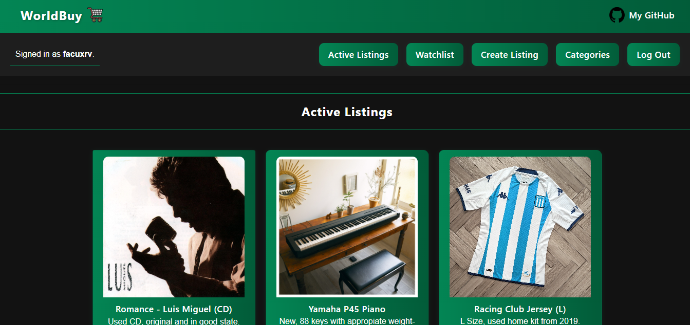
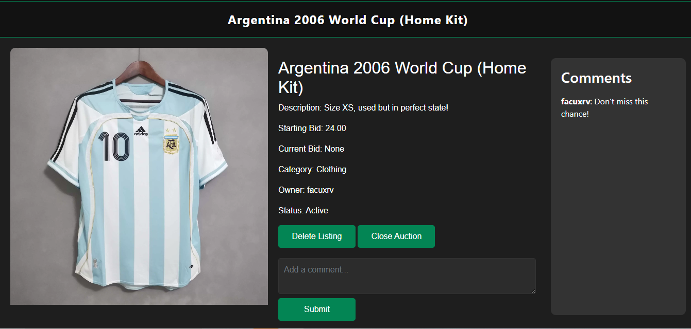
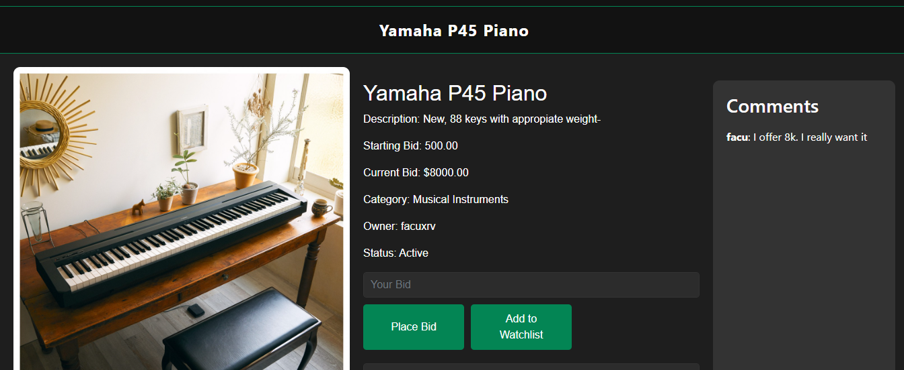
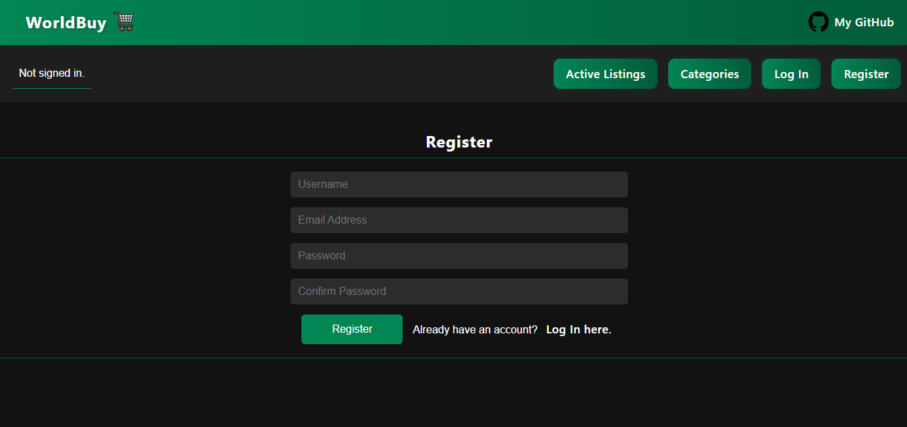

# WorldBuy - Django Auction Platform

A modern, full-featured auction platform built with Django, inspired by eBay. Users can create listings, place bids, manage watchlists, and interact through comments.

## 🚀 Features

- **User Authentication**: Complete registration, login, and logout system
- **Auction Listings**: Create, view, and manage auction listings
- **Bidding System**: Place bids with real-time validation
- **Watchlist**: Save interesting listings for later
- **Categories**: Browse listings by category
- **Comments**: Engage with other users through comments
- **Responsive Design**: Modern UI with custom CSS styling

## 🛠 Tech Stack

- **Backend**: Django 5.2.3
- **Database**: SQLite (development)
- **Frontend**: HTML5, CSS3, Bootstrap 4
- **Authentication**: Django's built-in authentication system

## 📱 Screenshots


*Browse active auction listings*


*View products information, give the auction creator options for closing and deleting the auction*


*View products information, be able to place a bid, comment and add to watchlist*


*Functional user registration page*


## 🎭 Demo Content

The project includes sample auction listings to showcase functionality:

- **Music**: Luis Miguel CD collection
- **Musical Instruments**: Yamaha P45 Piano
- **Clothing**: Football jerseys (Racing Club, Argentina)
- **Books**: Classic literature (Crime and Punishment)
- **Animals**: Adorable pets looking for homes

All demo listings include realistic descriptions, starting bids, and high-quality images.

## 🚀 Quick Start

### Prerequisites

- Python 3.8+
- pip (Python package manager)

### Installation

1. **Clone the repository**
   ```bash
   git clone https://github.com/facuxrv/worldbuy-auction-platform.git
   cd worldbuy-auction-platform
   ```

2. **Create a virtual environment**
   ```bash
   python -m venv venv
   source venv/bin/activate  
   ```

3. **Install dependencies**
   ```bash
   pip install django
   ```

4. **Run database migrations**
   ```bash
   python manage.py makemigrations
   python manage.py migrate
   ```

5. **Create a superuser (optional)**
   ```bash
   python manage.py createsuperuser
   ```

6. **Start the development server**
   ```bash
   python manage.py runserver
   ```

7. **Set up demo data (optional)**
   ```bash
   python setup_demo_data.py
   ```

8. **Open your browser** and navigate to `http://127.0.0.1:8000`

### Demo Credentials
- **Demo User**: `demo_user` / `demo123`
- **Sample Content**: 6 diverse auction listings across different categories

## 📁 Project Structure

```
commerce/
│
├── auctions/                 # Main application
│   ├── migrations/          # Database migrations
│   ├── static/auctions/     # CSS, JS, images
│   ├── templates/auctions/  # HTML templates
│   ├── models.py           # Database models
│   ├── views.py            # View functions
│   └── urls.py             # URL patterns
│
├── commerce/               # Project settings
│   ├── settings.py        # Django settings
│   ├── urls.py           # Main URL configuration
│   └── wsgi.py           # WSGI configuration
│
├── manage.py              # Django management script
└── db.sqlite3            # SQLite database
```

## 🎯 Key Features Explained

### User Management
- Secure user registration and authentication
- User-specific watchlists and bidding history
- Owner-only controls for listing management

### Auction System
- **Active Listings**: Browse all current auctions
- **Bidding**: Place bids with validation against current highest bid
- **Auction Status**: Automatic status tracking (active/closed)
- **Categories**: Filter listings by category

### Interactive Features
- **Watchlist**: Save listings for easy access
- **Comments**: Community interaction on listings
- **Real-time Updates**: Bid updates reflect immediately

## 🎨 Design Features

- **Modern UI**: Clean, professional design with green theme
- **Responsive Layout**: Works on desktop and mobile devices
- **User-Friendly Navigation**: Intuitive menu system
- **Visual Feedback**: Clear status messages and validation

## 🔧 Models

### User
- Extends Django's AbstractUser
- Handles authentication and user profiles

### AuctionListings
- Title, description, starting bid
- Current bid tracking
- Category and image support
- Active/inactive status

### Bid
- Links users to listings
- Tracks bid amounts and timestamps
- Maintains bidding history

### Comment
- User comments on listings
- Threaded discussion support

### Watchlist
- User-specific saved listings
- Easy bookmark functionality


## 👤 Author

**Facundo Ivan Kisielus**
- GitHub: [@facuxrv](https://github.com/facuxrv)


